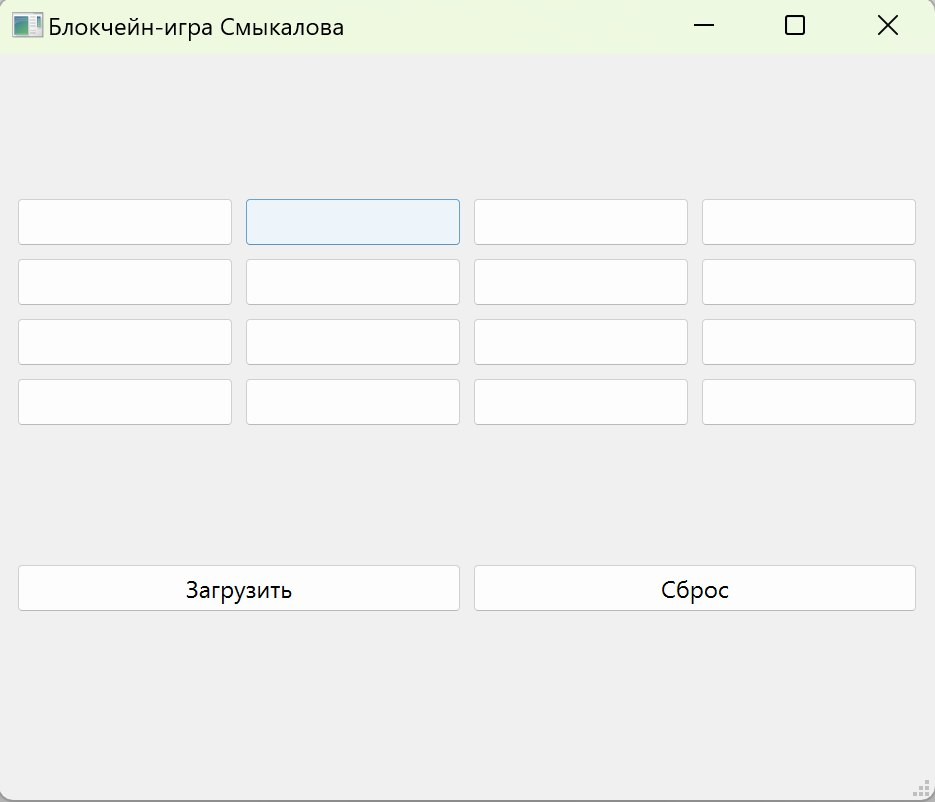
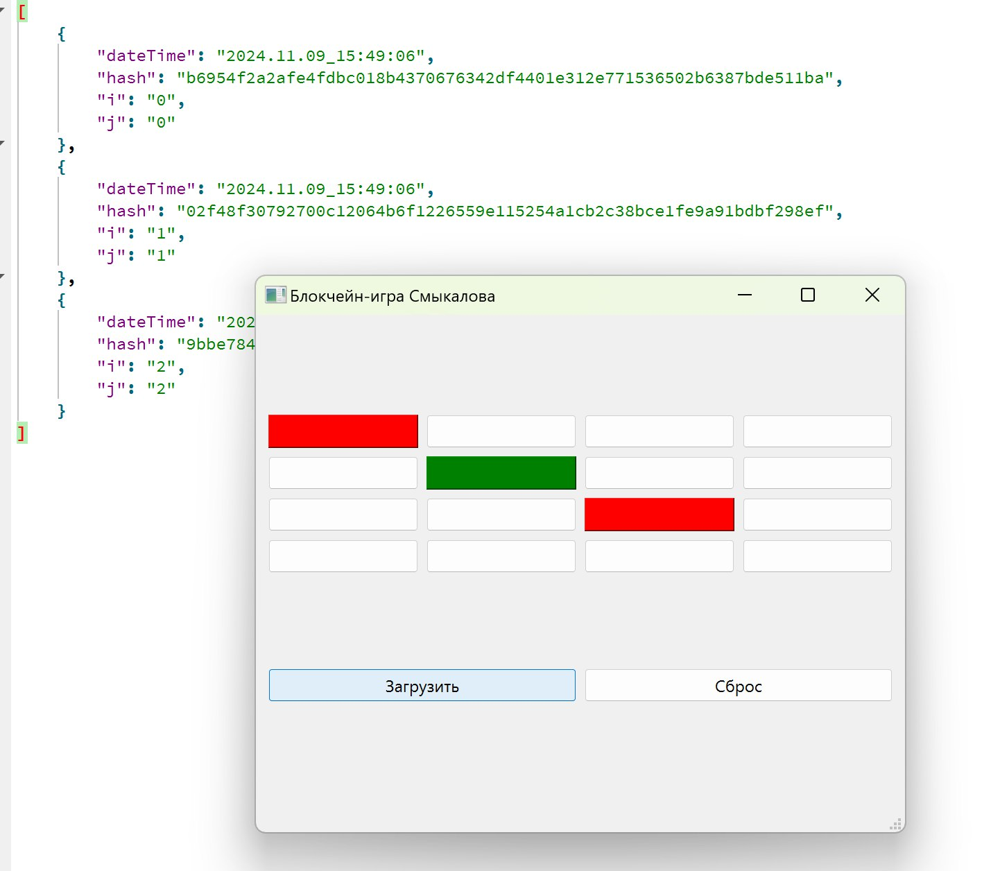

# Игра с блокчейн-защитой ходов

## Описание

Это приложение представляет собой игру с защитой ходов с использованием блокчейн-технологий. Каждое действие пользователя записывается в файл с соответствующим хешом, что позволяет обеспечивать целостность данных и исключать возможность подмены ходов. В программе реализовано игровое поле размером 4x4, где при каждом клике на клетку генерируется ход, сохраняемый в формате JSON с хеш-суммой, которая вычисляется на основе предыдущего хеша и текущих данных о ходе.

## Основные функции

- **Игровое поле**: Представлено в виде кнопок (размер 4x4), каждая из которых может быть помечена красным или зелёным цветом в зависимости от очередности хода.
- **Загрузка состояний**: При нажатии на кнопку "Загрузить" загружается сохранённое состояние игры, восстанавливаются цвета кнопок и проверяется корректность хешей.
- **Сброс игры**: Кнопка "Сброс" позволяет очистить игровое поле, вернуть все кнопки в исходное состояние.

## Снимки интерфейса

### Главный экран игры
На главном экране отображается игровое поле с кнопками, на которые можно кликать для выполнения ходов.

### Диалог загрузки
После нажатия на кнопку "Загрузить" отображается состояние игры, загруженное из файла.

## Технологии

- **Qt**: Используется для создания графического интерфейса.
- **SHA-256**: Для вычисления хешей ходов.
- **JSON**: Для хранения и загрузки данных о ходах.
